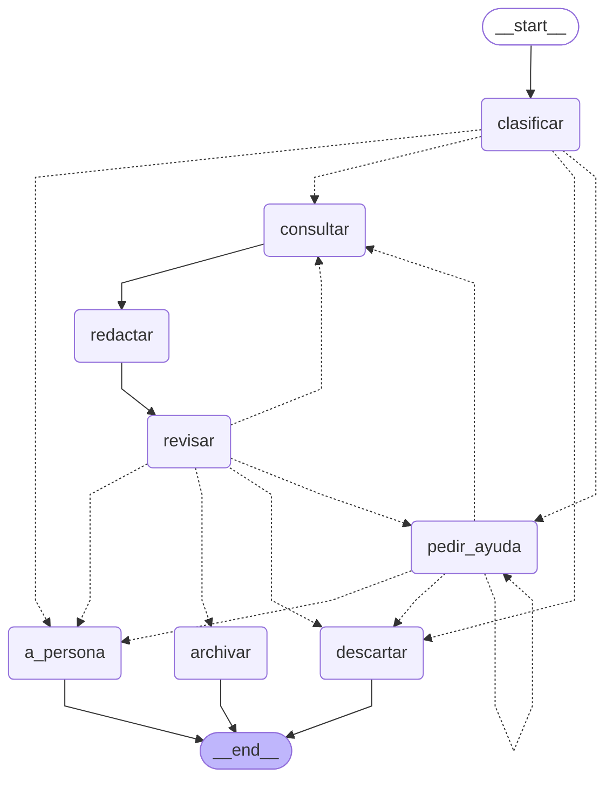

```mermaid
---
config:
  flowchart:
    curve: linear
---
graph TD;
	__start__([<p>__start__</p>]):::first
	clasificar(clasificar)
	pedir_ayuda(pedir_ayuda)
	consultar(consultar)
	redactar(redactar)
	revisar(revisar)
	archivar(archivar)
	a_persona(a_persona)
	descartar(descartar)
	__end__([<p>__end__</p>]):::last
	__start__ --> clasificar;
	clasificar -.-> a_persona;
	clasificar -.-> consultar;
	clasificar -.-> descartar;
	clasificar -.-> pedir_ayuda;
	consultar --> redactar;
	pedir_ayuda -.-> a_persona;
	pedir_ayuda -.-> consultar;
	pedir_ayuda -.-> descartar;
	redactar --> revisar;
	revisar -.-> a_persona;
	revisar -.-> archivar;
	revisar -.-> consultar;
	revisar -.-> descartar;
	revisar -.-> pedir_ayuda;
	a_persona --> __end__;
	archivar --> __end__;
	descartar --> __end__;
	pedir_ayuda -.-> pedir_ayuda;
	classDef default fill:#f2f0ff,line-height:1.2
	classDef first fill-opacity:0
	classDef last fill:#bfb6fc
```
