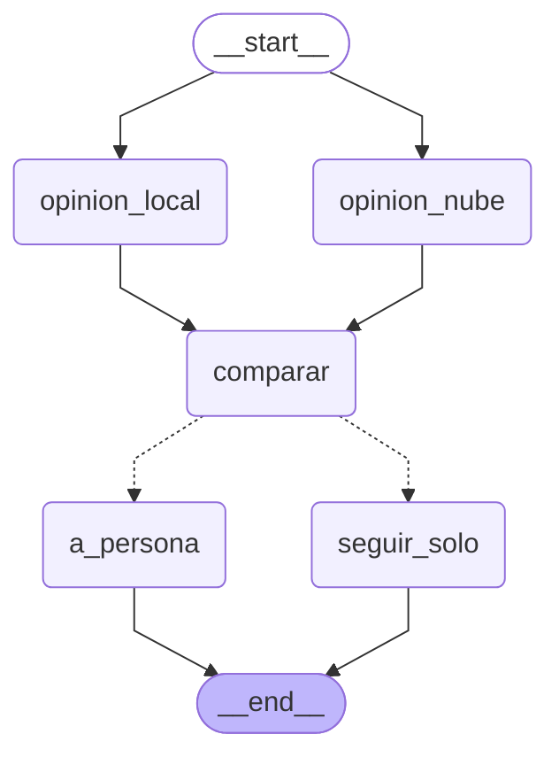

```mermaid
---
config:
  flowchart:
    curve: linear
---
graph TD;
	__start__([<p>__start__</p>]):::first
	opinion_nube(opinion_nube)
	opinion_local(opinion_local)
	comparar(comparar)
	seguir_solo(seguir_solo)
	a_persona(a_persona)
	__end__([<p>__end__</p>]):::last
	__start__ --> opinion_local;
	__start__ --> opinion_nube;
	comparar -.-> a_persona;
	comparar -.-> seguir_solo;
	opinion_local --> comparar;
	opinion_nube --> comparar;
	a_persona --> __end__;
	seguir_solo --> __end__;
	classDef default fill:#f2f0ff,line-height:1.2
	classDef first fill-opacity:0
	classDef last fill:#bfb6fc
```
