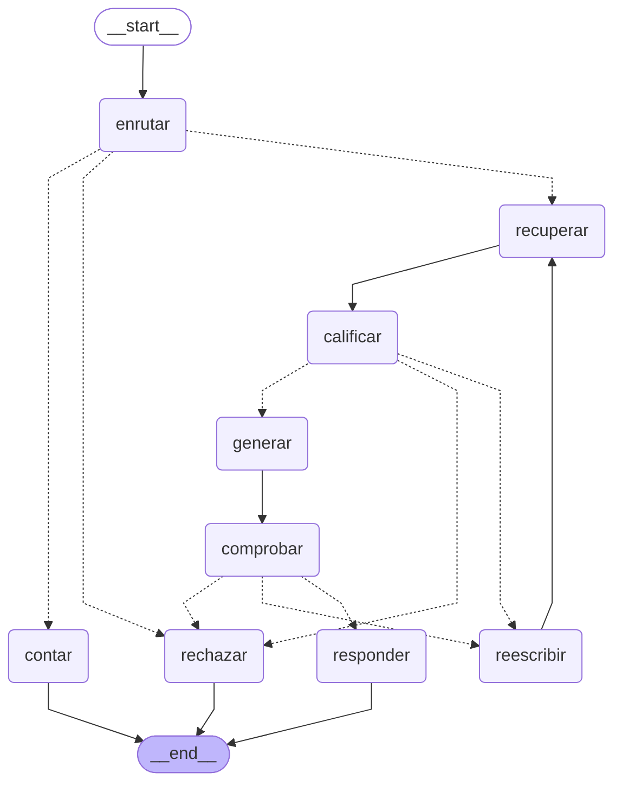

```mermaid
---
config:
  flowchart:
    curve: linear
---
graph TD;
	__start__([<p>__start__</p>]):::first
	enrutar(enrutar)
	recuperar(recuperar)
	calificar(calificar)
	reescribir(reescribir)
	generar(generar)
	comprobar(comprobar)
	responder(responder)
	rechazar(rechazar)
	contar(contar)
	__end__([<p>__end__</p>]):::last
	__start__ --> enrutar;
	calificar -.-> generar;
	calificar -.-> rechazar;
	calificar -.-> reescribir;
	comprobar -.-> rechazar;
	comprobar -.-> reescribir;
	comprobar -.-> responder;
	enrutar -.-> contar;
	enrutar -.-> rechazar;
	enrutar -.-> recuperar;
	generar --> comprobar;
	recuperar --> calificar;
	reescribir --> recuperar;
	contar --> __end__;
	rechazar --> __end__;
	responder --> __end__;
	classDef default fill:#f2f0ff,line-height:1.2
	classDef first fill-opacity:0
	classDef last fill:#bfb6fc
```
