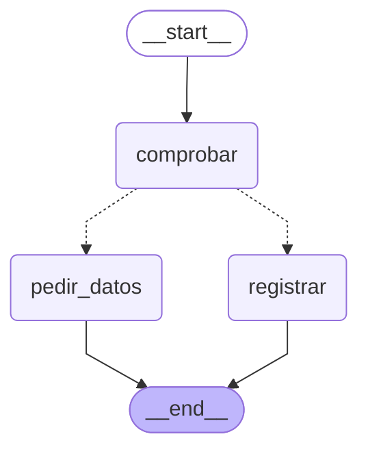

```mermaid
---
config:
  flowchart:
    curve: linear
---
graph TD;
	__start__([<p>__start__</p>]):::first
	comprobar(comprobar)
	pedir_datos(pedir_datos)
	registrar(registrar)
	__end__([<p>__end__</p>]):::last
	__start__ --> comprobar;
	comprobar -.-> pedir_datos;
	comprobar -.-> registrar;
	pedir_datos --> __end__;
	registrar --> __end__;
	classDef default fill:#f2f0ff,line-height:1.2
	classDef first fill-opacity:0
	classDef last fill:#bfb6fc
```
